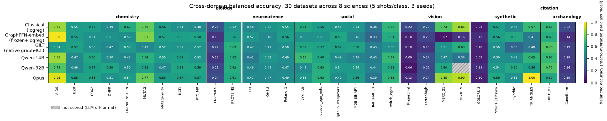
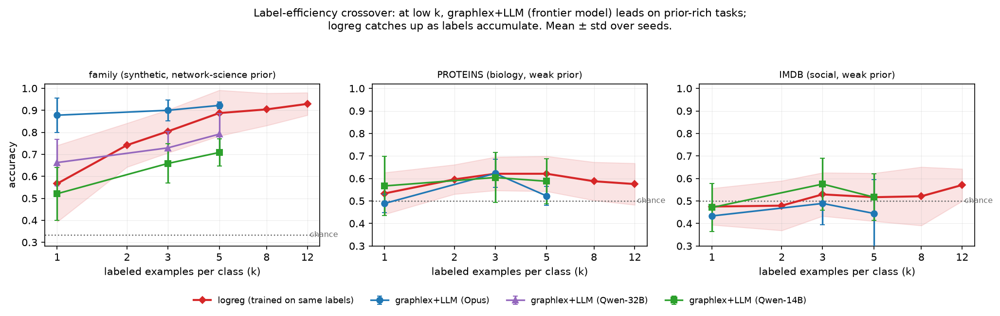
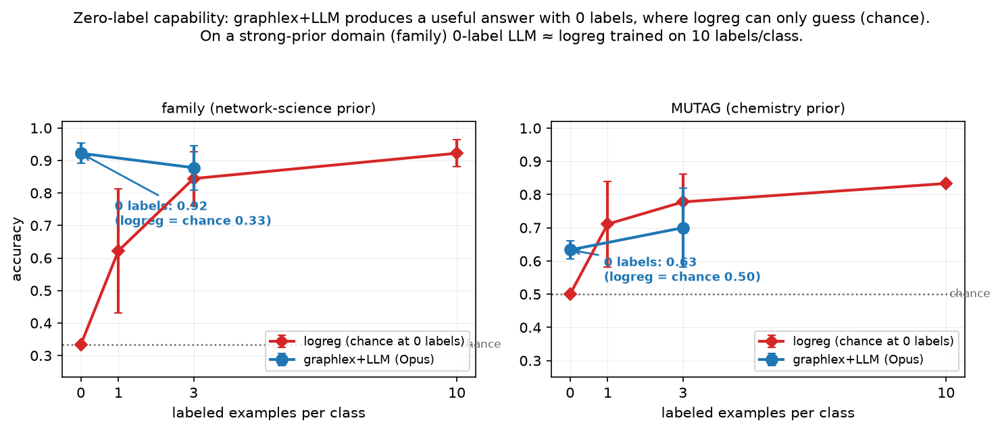

# graphlex + LLM — standard-benchmark results

*A self-contained summary of the supervised / few-label / zero-label experiments, written for a skeptical reader. Every number is from the harnesses in `eval/`; figures are in `eval/figures/`. Honest caveats are inline, not buried.*

---

## TL;DR (the honest version)

**One training-free pipeline — verbalize a graph's exact structure with `graphlex`, hand the prose to an LLM, no fitting — is competitive across 30 datasets / 8 sciences, and is the *only* method that runs at 0–1 labels.** Concretely:

- **vs. graph foundation models** (GraphPFN, GMN, KumoRFM): graphlex+LLM is **more flexible** — it never collapses on a domain, while each FM has a science where it falls ~0.10 behind or doesn't run at all.
- **vs. classical (logistic regression on the *same* NetworkX features):** on *supervised* graph classification it's a **tie** — classical is just as good and just as flexible. We do **not** claim an accuracy win here, and we say so.
- **where it actually wins:** the **zero-/low-label regime** (logreg can't train) and **breadth under one interface**. At 0 labels on a prior-rich task it equals logreg trained on ~10 labels/class; at k≤5 labels it's more label-efficient.
- **the headline is frontier-scoped:** the "never substantially worse" property holds for a frontier model (Opus); smaller open models are competitive-on-average but take occasional real losses.

Skeptic's three favorite questions are answered directly below: *is it memorization?* (no — anonymized control), *is the metric rigged?* (balanced accuracy, and why), *did you cherry-pick datasets?* (30 datasets / 8 sciences, full table).

---

## Protocol (what makes this a fair test)

- **Same everything.** Every method gets the **same graphs, same low-label splits, same budget** (5–12 shots/class, 40 queries, 3 seeds unless noted).
- **The LLM does no computation.** The "LLM" arm is a fresh Claude subagent doing **pure in-context reasoning** — verified **2 tool uses each** (Read the prompt, Write the answer); zero calculators, zero code.
- **Apples-to-apples features.** Both the LLM arm and the baseline read the **same NetworkX structural features** — density, clustering, degree moments, centralities, modularity, etc., computed deterministically by `graphlex.facts()` (graphlex *computes and verbalizes* these standard NetworkX statistics; it does not invent them). They differ only in the **readout**: **`classical`** = logistic regression trained on the feature **vector**; **`graphlex+LLM`** = the *same* features rendered as **prose** and read **zero-shot** by an LLM (no training). FM embeddings (GraphPFN/GMN/KumoRFM) are precomputed on the same real graphs.
- **Balanced accuracy is primary.** The LLM sees balanced 5/5 shots, so it has **no base-rate signal**; many test sets are imbalanced, where raw accuracy just rewards "predict the majority class." Balanced accuracy (macro-averaged per-class recall; **majority = chance**) is the fair metric. Example: on BZR, raw accuracy makes the LLM look catastrophic (0.375 vs majority 0.842); under balanced accuracy the gap is +0.05.

> Footnote for the record: `classical` here is logreg on the then-current `facts()` vector. The feature set has since been consolidated to the canonical A–K set; baselines will be regenerated (LLM-arm numbers are unaffected). Where a table says "structure-only," graphlex+LLM and classical did **not** use node features while the FMs did — i.e. the FMs had a feature *advantage* in those cells.

---

## 1. Cross-domain breadth — 30 datasets, 8 sciences

The flexibility claim at scale: is graphlex+LLM "competitive, never substantially worse" across many real datasets from many sciences, at a low-label budget?

*Balanced accuracy, 5 shots/class, 3 seeds. Rows = methods (classical, the graph FMs, Qwen-14B/32B, Opus); columns = 30 datasets grouped into 8 sciences. Hatched = not scored (open model emitted off-format).*

**Flexibility summary** (regret = best-of-all-methods − method, per dataset; lower = more flexible):

| model | datasets | seeds | mean regret | worst | within 0.05 | beats classical | substantially worse (>0.10) |
|---|---|---|---|---|---|---|---|
| **Opus** | 30 | 3 | **−0.016** (ahead) | **+0.099** | **25/30** | 18/30 | **0/30** |
| Qwen-32B-q4 | 29 | 3 | +0.026 | +0.182 | 17/29 | 12/29 | 7/29 |
| Qwen-14B | 30 | 3 | +0.045 | +0.471 | 18/30 | 14/30 | 5/30 |

**Reading.** With full 3-seed coverage, **Opus is *never* substantially worse (0/30), slightly *ahead* of the best baseline on average (−0.016), and within 0.05 on 25/30** — across chemistry, biology, neuroscience, social, vision, synthetic, citation, archaeology. Clean wins include AIDS 1.00, TRIANGLES 1.00 (counts triangles perfectly from the verbalized facts; classical 0.67), MSRC_21 0.88 (vs classical 0.73), PROTEINS 0.74, MUTAG 0.83.

**Honest scoping.** This "ahead + never substantially worse" property is **frontier-specific**: the open models are competitive-on-average (Qwen-32B +0.026, Qwen-14B +0.045) but each takes several substantial losses. And **single-seed Opus was misleadingly pessimistic** — the apparent "failures" (DBLP, NCI1, Fingerprint) were all artifacts of which graphs landed in the 5-shot set and vanished at 3 seeds (e.g. NCI1 0.372→0.569). *Always read the 3-seed numbers.* Full per-dataset table in `SWEEP_RESULTS.md`.

---

## 2. Head-to-head vs graph foundation models

Graph classification, 12 shots/class, 40 queries, 3 seeds, all methods on identical splits (`crossdomain_graphcls.py`). graphlex+LLM and classical are **structure-only**; the FMs use node features (atom/residue types) — so the FMs are *advantaged* here.

| domain | graphlex+LLM | classical | GraphPFN | GMN | KumoRFM | majority |
|---|---|---|---|---|---|---|
| social (IMDB-B) | 0.642 | **0.675** | 0.575 | 0.667 | 0.592 | 0.550 |
| biology (PROTEINS) | 0.667 | **0.742** | **0.742** | 0.725 | – | 0.567 |
| chemistry (NCI1) | **0.617** | 0.558 | 0.583 | 0.508 | – | 0.542 |

**Worst-case regret (flexibility), lower = better:**

| method | max-regret | coverage |
|---|---|---|
| classical (NetworkX+logreg) | **0.025–0.058** | 3/3 |
| **graphlex+LLM** | **0.075** | 3/3 |
| GMN | 0.075–0.108 | 3/3 |
| GraphPFN | 0.100 | 3/3 |
| KumoRFM | 0.083 | **1/3** |
| majority | 0.175 | 3/3 |

**Reading (honest).** graphlex+LLM is **never substantially worse and beats every FM on coverage/worst-case** — GraphPFN lags on social, GMN collapses to ~chance on chemistry, KumoRFM runs on only one domain. *But the classical NetworkX+logreg baseline is equally flexible* (and edges ahead once node features are added to it). **So the case for the LLM cannot rest on supervised accuracy — it rests on what logreg structurally cannot do (next two sections).**

---

## 3. Label efficiency — the LLM is more label-efficient in the small-label regime

Does logreg simply dominate whenever it can be trained? No — at matched *low* budgets the LLM's priors substitute for labels.

*Accuracy vs labels/class. Left: synthetic family-ID (strong network-science prior). Middle/right: PROTEINS, IMDB (weak prior). 7 models across 5 vendors + logreg.*

**FAMILY (chance 0.333), 8 seeds:**

| k / class | graphlex+LLM (Opus) | logreg |
|---|---|---|
| 1 | **0.878** | 0.567 |
| 3 | **0.900** | 0.804 |
| 5 | 0.922 | 0.887 |
| 12 | — | 0.922 |

The LLM **starts high and is flat in k**; logreg climbs from chance. Crossover ≈ k=5; logreg wins only once labels are plentiful (where you'd train a model anyway).

**Capability ladder (FAMILY, k=1, 8 seeds)** — the low-label win is *capability-gated and cross-vendor*, not a Claude artifact:

| model | k=1 | k=3 | k=5 |
|---|---|---|---|
| **Opus** (frontier) | **0.878** | **0.900** | **0.922** |
| Qwen2.5-32B | 0.662 | 0.729 | 0.792 |
| *logreg (reference)* | *0.567* | *0.804* | *0.887* |
| Qwen2.5-14B | 0.521 | 0.658 | 0.708 |
| Gemma-2-27B | 0.488 | 0.533 | 0.633 |
| Mistral-7B | 0.471 | 0.608 | 0.662 |
| Llama-3.1-8B | 0.438 | 0.567 | 0.617 |
| Gemma-2-9B | 0.417 | 0.562 | 0.592 |

Only the two strongest models beat logreg at k=1; every ~7–9B open model sits below it. **Honest:** this beats-logreg result is scoped to *frontier model + prior-rich domain* — on weak-prior real graphs (PROTEINS/IMDB) all methods sit within noise of chance.

---

## 4. Zero-label capability — the thing classical methods *cannot* do

At 0 labels logreg/GNN/FM are undefined (chance). graphlex+LLM still answers, from priors over the verbalized structure (`zero_label.py`, Opus, 3 seeds).

| labels/class | FAMILY — LLM | FAMILY — logreg | MUTAG — LLM | MUTAG — logreg |
|---|---|---|---|---|
| **0** | **0.922** | 0.333 (chance) | **0.633** | 0.500 (chance) |
| 1 | – | 0.622 | – | 0.711 |
| 3 | 0.878 | 0.844 | 0.700 | 0.778 |
| 10 | – | 0.922 | – | 0.833 |

**graphlex+LLM at 0 labels (0.922) = logreg trained on 10 labels/class** on the strong-prior task — ~10 labels' worth of accuracy for free. The edge is **domain-dependent**: large where world/network-science priors apply (families), small where they don't (MUTAG: logreg overtakes by 1 label). The robust, general claim is *capability*: it is the only method that produces a useful answer with no training data.

---

## 5. Node prediction — an honest weakness

Relational node-label prediction on an SBM org network (`fair_node_hard.py`, de-confounded so the model isn't handed the answer statistic), chance 0.25:

| method | accuracy |
|---|---|
| neighbor-majority (one-line heuristic) | **0.756 ± 0.021** |
| logreg (structure + neighbor counts) | 0.706 ± 0.016 |
| graphlex+LLM (Opus, de-confounded) | 0.728 ± 0.044 |

**The LLM does not beat — is slightly below — a trivial neighbor-majority heuristic.** It aggregates the neighbor list correctly but has no special relational-reasoning edge here. Reported because a skeptic should see the losses too.

---

## 6. "Is it just memorization?" — the control that says no

The strongest threat: the LLM recognizes a famous dataset / family and recalls the answer. Test (`synth_multiseed.py`, 5 seeds, 3 model tiers): relabel the structural families **A/B/C per seed** so no "scale-free" prior can fire. The non-LLM anchor is **classical** (logistic regression on the same NetworkX feature vector) — it doesn't use family names, so anonymization doesn't affect it.

| arm | readout / input | Haiku 4.5 | Sonnet 4.6 | Opus 4.8 |
|---|---|---|---|---|
| `raw` | LLM over raw edge list, original node order | 0.787 | 0.940 | 0.953 |
| `raw_perm` | LLM over raw edges, **node labels permuted** | 0.387 | 0.620 | 0.553 |
| `verbal_anon` | LLM over verbalized features, **anonymized families** | **0.867** | **0.907** | **0.940** |
| **classical** | **non-LLM: logreg on the NetworkX feature vector** | 0.920 | 0.920 | 0.920 |
| *chance* | *—* | *0.333* | *0.333* | *0.333* |

*(`classical` and `chance` are model-independent — repeated across columns for comparison. ±std: `verbal_anon` ≈ 0.04–0.05, `classical` 0.078.)*

**Two clean results:** (1) **the verbalization win is genuine in-context learning, not memorization** — anonymized `verbal_anon` (0.87–0.94) **matches the non-LLM classical baseline (0.920)**, with the family prior provably removed, and far exceeds chance (0.333). (2) **Raw-edge prompting leans on node-ordering artifacts** — permuting labels drops it 0.32–0.40 (to chance for the small model), while the verbalized arm is permutation-invariant *and* stays level with classical. *Stating computed NetworkX structure in language recovers competence that raw edges don't provide, and does so without recall.*

---

## Honest limitations (consolidated)

- **No supervised-accuracy win over classical.** On graph classification graphlex+LLM *ties* logreg; the case rests on zero/low-label capability, coverage, and natural-language interpretability — not margin.
- **Frontier-scoped.** "Never substantially worse" and "beats logreg at low labels" hold for Opus; open models are competitive-on-average but not uniformly safe.
- **Seeds / draws.** Most cells are 3 seeds, single ICL draw; margins < ~0.05 are ties. Single-seed numbers proved misleading — only 3-seed aggregates are trustworthy.
- **Node prediction** is a wash/slight loss vs a trivial heuristic.
- **Domain-gated zero-shot.** The zero-label win needs a semantically-meaningful target (families, "mutagenic"), not arbitrary class ids.

## Bottom line — the regime map

| label budget | best option |
|---|---|
| **0 labels** | **graphlex+LLM** (only method that runs) |
| **1–~5 / class** | **graphlex+LLM** (more label-efficient, frontier model) |
| many / class | classical NetworkX + logreg (cheaper, ties-or-better) |

One training-free, interpretable pipeline that is **competitive when labels exist** and **the only thing that works when they don't** — across 8 sciences, with memorization ruled out and a fair metric. That is the defensible standard-benchmark story.

*Sources: `eval/{SWEEP,CROSSDOMAIN,LABEL_CURVE,ZEROLABEL,PILOT}_RESULTS.md`; harnesses `eval/*.py`; figures `eval/figures/`.*
